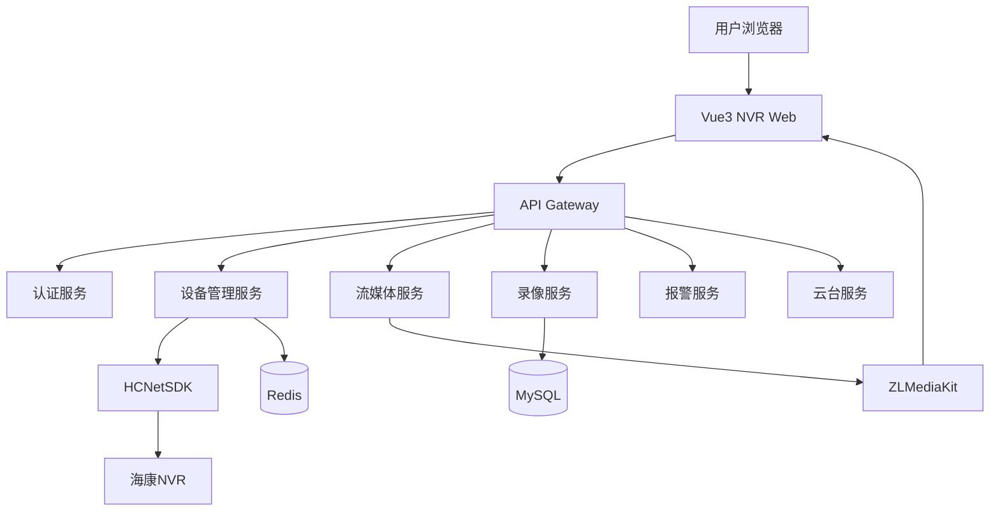
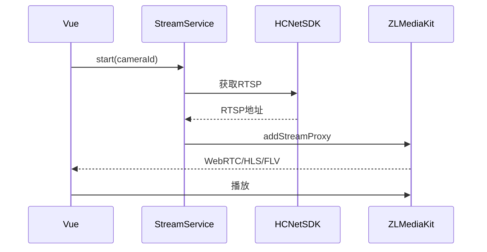

# 企业级 NVR 平台重构设计文档

版本：v1.0

## 1. 项目目标

构建企业级视频管理平台，支持：

- 海康 HCNetSDK 接入
- 多 NVR 管理
- 摄像头自动发现
- RTSP 接入
- ZLMediaKit 流媒体转换
- WebRTC/HLS/FLV 输出
- 多路实时预览
- 多路录像回放
- PTZ 云台控制
- 报警联动
- 用户权限管理

---

# 2. 总体架构



---

# 3. 视频流链路



---

# 4. 后端模块

```
hk-nvr-server

controller
 ├── DeviceController
 ├── StreamController
 ├── PlaybackController
 ├── AlarmController
 └── PtzController

service
 ├── CameraService
 ├── StreamService
 ├── PlaybackService
 ├── AlarmService
 └── PtzService

model
 ├── CameraInfo
 ├── StreamSession
 ├── PlaybackTask
 └── AlarmEvent
```

---

# 5. API接口文档

## 5.1 NVR登录

### 请求

```
POST /api/device/login
```

### 参数

```json
{
 "deviceId":"nvr001",
 "ip":"192.168.1.64",
 "port":8000,
 "username":"admin",
 "password":"123456"
}
```

### 响应

```json
{
 "code":0,
 "message":"success",
 "data":{
  "deviceId":"nvr001",
  "status":"ONLINE"
 }
}
```

---

## 5.2 获取摄像头列表

请求：

```
GET /api/device/cameras
```

响应：

```json
[
 {
  "id":"cam001",
  "name":"大厅摄像头",
  "ip":"192.168.1.101",
  "channel":33,
  "mainStream":"rtsp://xxx/3301",
  "subStream":"rtsp://xxx/3302",
  "online":true
 }
]
```

---

## 5.3 启动实时视频

请求：

```
POST /api/stream/start/{cameraId}
```

响应：

```json
{
 "cameraId":"cam001",
 "webrtcUrl":"http://zlm/webrtc",
 "hlsUrl":"http://zlm/live/cam001.m3u8",
 "flvUrl":"http://zlm/live/cam001.flv"
}
```

---

## 5.4 多路预览

请求：

```
POST /api/stream/multi
```

参数：

```json
[
 "cam001",
 "cam002",
 "cam003"
]
```

---

## 5.5 查询录像

请求：

```
GET /api/record/search
```

参数：

|参数|类型|说明|
|-|-|-|
|channel|int|通道|
|start|string|开始时间|
|end|string|结束时间|

响应：

```json
[
 {
  "id":"001",
  "startTime":"2026-08-23 10:00:00",
  "endTime":"2026-08-23 11:00:00"
 }
]
```

---

## 5.6 开始回放

请求：

```
POST /api/playback/start
```

参数：

```json
{
 "cameraId":"cam001",
 "start":"2026-08-23 10:00:00",
 "end":"2026-08-23 11:00:00"
}
```

响应：

```json
{
 "taskId":"task001",
 "hlsUrl":"http://server/hls/task001.m3u8"
}
```

---

## 5.7 云台控制

请求：

```
POST /api/ptz/control
```

参数：

```json
{
 "cameraId":"cam001",
 "command":"LEFT",
 "speed":5
}
```

command:

- UP
- DOWN
- LEFT
- RIGHT
- ZOOM_IN
- ZOOM_OUT

---

## 5.8 报警WebSocket

连接：

```
ws://server/ws/alarm
```

消息：

```json
{
 "type":"MOTION",
 "cameraId":"cam001",
 "time":"2026-08-23 12:00:00",
 "message":"移动侦测"
}
```

---

# 6. 前端架构

```
hk-nvr-web

components
 ├── VideoPlayer.vue
 ├── VideoWall.vue
 ├── PlaybackPlayer.vue
 └── Timeline.vue

views
 ├── Monitor.vue
 └── Playback.vue
```

---

# 7. 后续扩展

- GB28181国标接入
- ONVIF自动发现
- AI智能分析
- GIS地图
- 数字孪生三维场景
- 多租户SaaS架构
